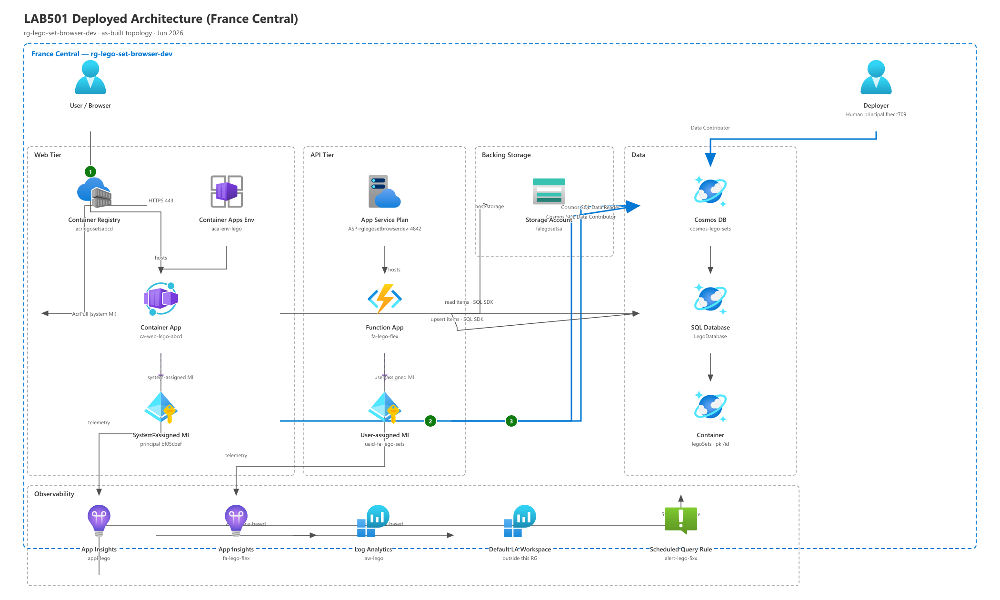
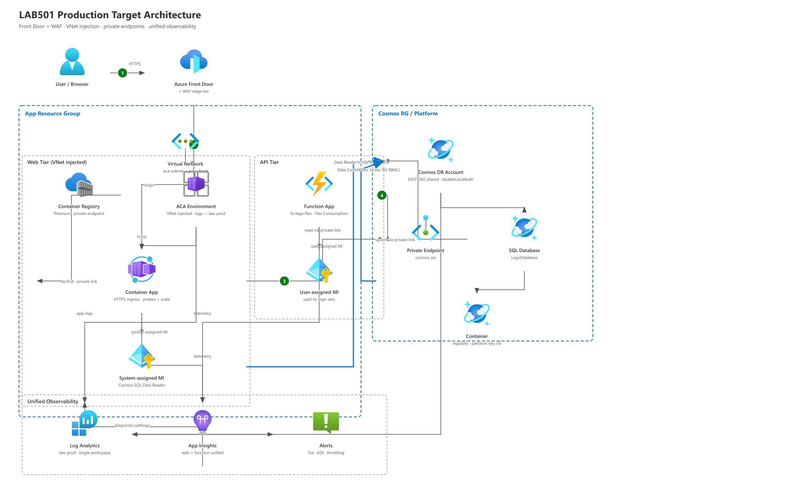

# LEGO Vault

**Microsoft Build 2026 LAB501** | Flask catalog browser on Azure Container Apps, backed by Cosmos DB and a Flex Consumption ingest function.

[](https://ca-web-lego-abcd.calmrock-4a13cc87.francecentral.azurecontainerapps.io/browse)
[](https://azure.microsoft.com/explore/global-infrastructure/geographies/)
[](https://www.python.org/)
[](https://flask.palletsprojects.com/)

## Live demo

Browse the deployed catalog: **[ca-web-lego-abcd ... /browse](https://ca-web-lego-abcd.calmrock-4a13cc87.francecentral.azurecontainerapps.io/browse)**

The app serves paginated search and filter over LEGO sets stored in Cosmos DB, with set detail pages and a Rebrickable image proxy. Open the browse URL to see the Star Wars themed UI in production.

## What this lab achieves

End-to-end **agentic DevOps on Azure**: ship a real app, harden it, break it on purpose, then investigate and operationalize with KQL and alerts.

| Scenario | Focus | Outcome |
|----------|-------|---------|
| **1 - Ship & Harden** | `azure-prepare` → `azure-validate` → `azure-deploy` + `azure-rbac` | Flask Container App and Python Function (`fa-lego-flex`) deployed from Bicep; Cosmos `disableLocalAuth`, managed-identity RBAC, ACR admin disabled |
| **2 - See & Evaluate** | `azure-resource-visualizer` + architecture review | Deployed topology documented; production gaps identified (network isolation, unified observability, external Cosmos) |
| **3 - Break & Triage** | Intentional ingress misconfiguration | `targetPort` set to 9999 while gunicorn listens on 8000; triaged 503s with `azure-diagnostics` and live revision logs |
| **4 - Investigate & Operationalize** | KQL post-mortem + scheduled query alert | Incident timeline from `ContainerAppHTTPLogs`; `alert-lego-5xx` monitors sustained HTTP 5xx on the web tier |

Full write-up: [Build localhost Accra to LAB501 on Azure](https://michaeltettey.dev/thoughtsbymike/build-localhost-accra-lab501-azure/)

## Architecture

### Deployed (dev)

Current footprint in **`rg-lego-set-browser-dev`** (France Central): external HTTPS ingress on Container Apps, read path via system-assigned MI, ingest via Function UAMI, workspace-based App Insights, and Cosmos key auth disabled.



*Read path: Container App system MI → Cosmos Data Reader. Write path: `fa-lego-flex` UAMI → Cosmos Data Contributor.*

### Production target

Recommended hardening: Front Door + WAF, VNet-injected ACA, Cosmos private endpoint in a platform RG, single Log Analytics workspace, and no standing human data-plane roles.



*Detailed inventory, RBAC matrix, and gap analysis: [docs/architecture.md](docs/architecture.md)*

## Stack

| Layer | Technology | Role |
|-------|------------|------|
| Web | **Flask** + gunicorn | Browse, search, detail, `/image-proxy` |
| Compute | **Azure Container Apps** (`ca-web-lego-abcd`) | External HTTPS ingress, port 8000, scale 1–3 |
| Registry | **ACR** (`acrlegosetsabcd`) | `ca-web-lego:latest`; admin user disabled |
| Data | **Cosmos DB** SQL API (`cosmos-lego-sets`) | `LegoDatabase` / `legoSets`; `disableLocalAuth: true` |
| Ingest | **Azure Function** (`fa-lego-flex`, Flex Consumption FC1) | `upsert_lego` HTTP trigger; Python 3.12 |
| Identity | **Managed identities** | Web: system-assigned Data Reader; Function: UAMI `uaid-fa-lego-sets` Data Contributor |
| Observability | **App Insights** (`appi-lego`) + **Log Analytics** (`law-lego`) | HTTP telemetry; scheduled query `alert-lego-5xx` |
| IaC | **Bicep** + **Azure Developer CLI** (`azure.yaml`) | `infra/containerapp-lego`, `infra/cosmos`, `infra/functions-lego` |

## Deployment

| Item | Value |
|------|-------|
| Region | **France Central** |
| Resource group | `rg-lego-set-browser-dev` |
| Container App FQDN | `ca-web-lego-abcd.calmrock-4a13cc87.francecentral.azurecontainerapps.io` |
| Ingress | HTTPS only, `targetPort` **8000** (must match gunicorn bind) |

**Security hardening applied in this lab**

- Cosmos **`disableLocalAuth: true`** (no account keys; RBAC only)
- Container App and Function use **managed identities** for Cosmos data plane
- ACR **admin disabled**; image pull via system-assigned MI (`AcrPull`)
- Storage account: shared-key and public blob access disabled (Function host)

Deploy with Azure Developer CLI from the repo root (`azd up`) or the Bicep modules under `infra/`. Do not commit `.env`, connection strings, or keys.

## Local development

**Prerequisites:** Python 3.13+, Azure CLI logged in (`az login`), Cosmos account with LEGO dataset loaded, and **Cosmos DB Built-in Data Contributor** on your user principal (account uses `disableLocalAuth`).

```bash
pip install -r requirements.txt
cp .env.sample .env   # set COSMOS_ENDPOINT (and optional AZURE_CLIENT_ID)
python app.py         # http://localhost:5000
```

**Docker** (matches production port 8000):

```bash
docker build -t lego-set-browser .
docker run -p 8000:8000 --env-file .env lego-set-browser
```

| Variable | Description | Default |
|----------|-------------|---------|
| `COSMOS_ENDPOINT` | Cosmos account endpoint | *(required)* |
| `COSMOS_DATABASE` | Database name | `LegoDatabase` |
| `COSMOS_CONTAINER` | Container name | `legoSets` |
| `AZURE_CLIENT_ID` | Managed identity client ID (Azure only) | *(optional)* |

Seed or refresh catalog data: `seed_cosmos.py` and the Function under `src/azure_function/`.

## Documentation

| Doc | Contents |
|-----|----------|
| [docs/architecture.md](docs/architecture.md) | Live resource inventory, RBAC, observability wiring, production gaps |
| [docs/troubleshooting.md](docs/troubleshooting.md) | Lab-specific fixes, diagnostic commands, KQL notes |
| [docs/scenario-4-incident-report.md](docs/scenario-4-incident-report.md) | Scenario 3/4 post-mortem: port mismatch, HTTP log evidence, alert rule |

Lab instructions (parent repo): [Build26-LAB501 / docs/lab-instructions](https://github.com/microsoft/Build26-LAB501/tree/main/docs/lab-instructions)

## Project layout

```
lego-set-browser/
├── app.py                    # Flask routes + Cosmos queries
├── Dockerfile                # gunicorn on 0.0.0.0:8000
├── infra/                    # Bicep modules (Cosmos, ACA, Function)
├── src/azure_function/       # fa-lego-flex upsert_lego
├── templates/                # Jinja2 (browse, detail, home)
├── static/css/style.css      # Star Wars theme
└── docs/
    ├── architecture.md
    ├── troubleshooting.md
    └── images/               # Architecture diagrams
```

## Links

- **Live app:** [Browse LEGO sets](https://ca-web-lego-abcd.calmrock-4a13cc87.francecentral.azurecontainerapps.io/browse)
- **Lab repo:** [microsoft/Build26-LAB501](https://github.com/microsoft/Build26-LAB501)
- **App repo:** [Mtettey29/lego-set-browser](https://github.com/Mtettey29/lego-set-browser)
- **Write-up:** [From localhost Accra to LAB501 on Azure](https://michaeltettey.dev/thoughtsbymike/build-localhost-accra-lab501-azure/)

---

*Microsoft Build 2026 session LAB501: From Zero to Deployed on Azure with AI Agents*
