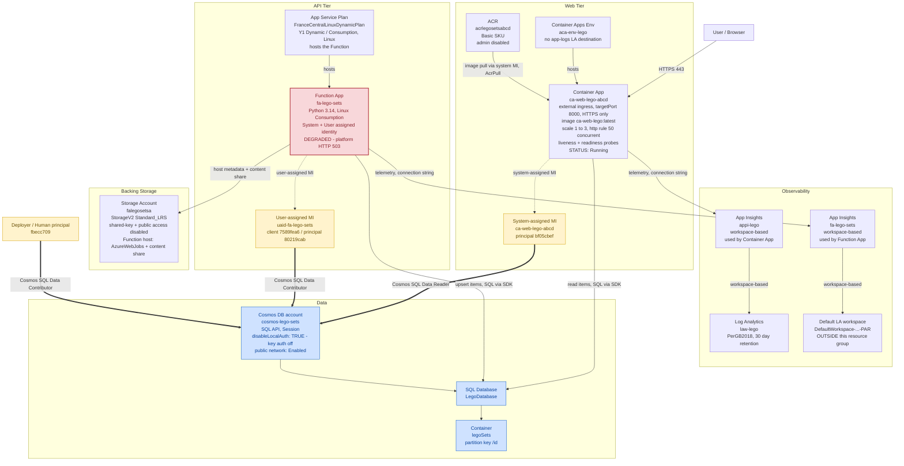

# LEGO Set Browser — Deployed Architecture (`rg-lego-set-browser-dev`)

This document captures the **actual deployed topology** of the LEGO Set Browser solution as
discovered live (read-only) in the **"Azure for Students"** subscription
(`6a4d2bbf-e536-448d-a119-f06b51ffd744`), resource group **`rg-lego-set-browser-dev`**
in **France Central**. It intentionally reflects reality rather than the lab's idealized
design: the **Function App is currently degraded (HTTP 503)**, the Container Apps environment
has **no Log Analytics app-logs destination**, **no classic diagnostic settings** are
configured, and the Function emits telemetry to **its own App Insights wired to a default
workspace outside this resource group**.

> **Cleanup note (refreshed Jun 2026):** the earlier leftover resources have been removed.
> The orphaned App Service Plan `fa-lego-sets-plan` (0 sites) and the duplicate storage
> account `falegosetssa` have been **deleted**. The diagram and inventory below now reflect
> only currently-existing resources: storage account `falegosetsa` is the live Function host
> store, and `FranceCentralLinuxDynamicPlan` is the sole App Service Plan.

The web tier is healthy and serving traffic; the read path (Container App → Cosmos via the
system-assigned managed identity with **Data Reader**) is intact, while the write/ingest path
(Function App → Cosmos via the user-assigned identity with **Data Contributor**) is impaired
because the Function platform is returning 503.

## Architecture diagram

## Resource inventory

| Resource | Type | Notes |
|----------|------|-------|
| `cosmos-lego-sets` | Cosmos DB account (`Microsoft.DocumentDB/databaseAccounts`) | SQL API (GlobalDocumentDB), Session consistency, **`disableLocalAuth: true`** (key auth off), public network **Enabled**, periodic geo backup, automatic failover. |
| `LegoDatabase` | Cosmos SQL database | Child of `cosmos-lego-sets`. |
| `legoSets` | Cosmos SQL container | Partition key `/id`, consistent indexing. |
| `ca-web-lego-abcd` | Container App (`Microsoft.App/containerApps`) | External ingress, target port **8000**, `allowInsecure: false`, image `acrlegosetsabcd.azurecr.io/ca-web-lego:latest`, scale **1→3** (HTTP rule, 50 concurrent), liveness + readiness probes, **Running**. System-assigned MI principal `bf05cbef`. Pulls image using system identity. |
| `aca-env-lego` | Container Apps managed environment (`Microsoft.App/managedEnvironments`) | Default domain `calmrock-4a13cc87.francecentral.azurecontainerapps.io`. **No app-logs Log Analytics destination configured.** |
| `acrlegosetsabcd` | Container Registry (`Microsoft.ContainerRegistry/registries`) | **Basic** SKU, **admin user disabled**, anonymous pull disabled, public network enabled. |
| `fa-lego-sets` | Function App (`Microsoft.Web/sites`, `functionapp,linux`) | **Python 3.14** on Linux Consumption (`FranceCentralLinuxDynamicPlan`, Y1 Dynamic). System + User assigned identity. **DEGRADED — returns HTTP 503 (platform unavailable).** Uses `AZURE_CLIENT_ID` of the UAMI for Cosmos. |
| `FranceCentralLinuxDynamicPlan` | App Service Plan (`Microsoft.Web/serverFarms`) | Y1 Dynamic, Linux (`reserved: true`), **1 site** (hosts `fa-lego-sets`). Sole App Service Plan after cleanup. |
| `uaid-fa-lego-sets` | User-assigned managed identity (`Microsoft.ManagedIdentity/userAssignedIdentities`) | Client `7589fea6`, principal `80219cab`. Holds Cosmos **Data Contributor** (write path). |
| `falegosetsa` | Storage Account (`Microsoft.Storage/storageAccounts`) | StorageV2 `Standard_LRS`, shared-key access and blob public access disabled. **Function host storage** (AzureWebJobsStorage + content share). |
| `law-lego` | Log Analytics workspace (`Microsoft.OperationalInsights/workspaces`) | `PerGB2018`, 30-day retention. Workspace for `appi-lego`. |
| `appi-lego` | Application Insights (`Microsoft.Insights/components`) | Workspace-based → `law-lego`. Instrumentation key `49225d18` matches the **Container App** connection string. |
| `fa-lego-sets` (Insights) | Application Insights (`Microsoft.Insights/components`) | Separate component for the Function App, **workspace-based but linked to `DefaultWorkspace-...-PAR` (outside this resource group)**. |
| `Application Insights Smart Detection` | Action group (`microsoft.insights/actiongroups`) | Auto-created with App Insights for smart-detection alerts. |

### Cosmos DB SQL role assignments (data plane)

| Principal | Identity | Role |
|-----------|----------|------|
| `bf05cbef-d78c-40e8-b888-51e7804e8297` | Container App system-assigned MI | **Cosmos DB Built-in Data Reader** (read path) |
| `80219cab-ecfb-4c55-8edb-a1d576ca0de0` | `uaid-fa-lego-sets` user-assigned MI | **Cosmos DB Built-in Data Contributor** (write path) |
| `fbecc709-7aa7-41a0-aac0-1b360f129771` | Deployer / human principal | **Cosmos DB Built-in Data Contributor** |

### Reality vs. idealized lab topology

- **Function App is down (HTTP 503)** — the ingest/write path to Cosmos is currently impaired.
- **No diagnostic settings** exist on the Container App, ACA environment, or Cosmos account; telemetry reaches App Insights only via the `APPLICATIONINSIGHTS_CONNECTION_STRING` app settings.
- **ACA environment has no Log Analytics app-logs destination** configured.
- **Two App Insights components**: the Container App reports to `appi-lego` (→ `law-lego`), while the Function reports to a separate `fa-lego-sets` component wired to a **default workspace outside this resource group**.
- **Cleanup completed**: the orphaned `fa-lego-sets-plan` (0 sites) and the duplicate storage account `falegosetssa` have been **deleted**; only `falegosetsa` and `FranceCentralLinuxDynamicPlan` remain.
- **Security hardening confirmed**: Cosmos `disableLocalAuth: true`, ACR admin disabled, the storage account has shared-key and public blob access disabled, Container App ingress is HTTPS-only.
