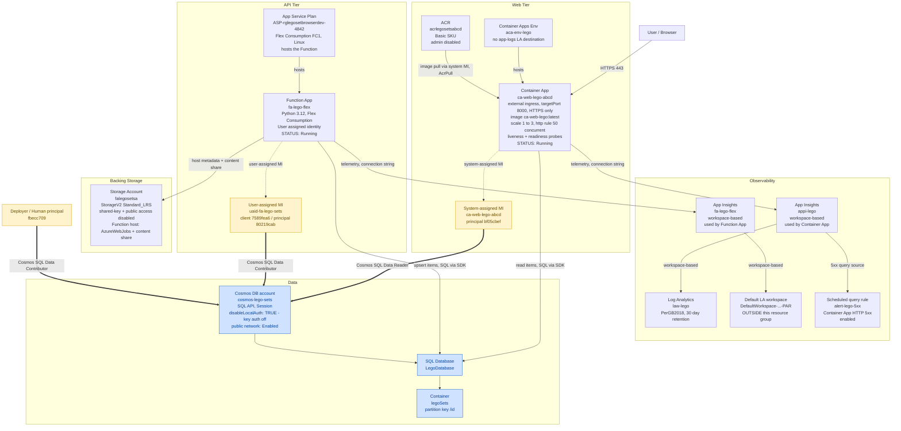
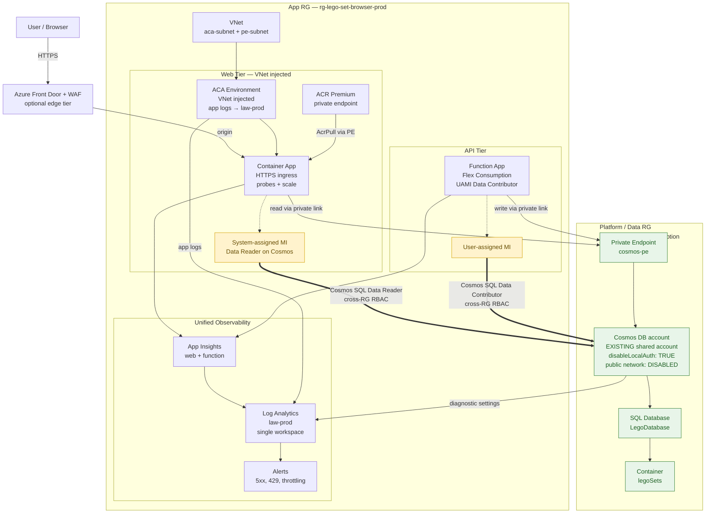

# LEGO Set Browser — Deployed Architecture (`rg-lego-set-browser-dev`)

This document captures the **actual deployed topology** of the LEGO Set Browser solution as
discovered live (read-only) in the **"Azure for Students"** subscription
(`6a4d2bbf-e536-448d-a119-f06b51ffd744`), resource group **`rg-lego-set-browser-dev`**
in **France Central**. It reflects the **post-cleanup state (Jun 2026)**: the legacy
Consumption Function App `fa-lego-sets` and its plan `FranceCentralLinuxDynamicPlan` have
been removed; ingest now runs on **`fa-lego-flex`** (Flex Consumption). The Container Apps
environment has **no Log Analytics app-logs destination**, **no classic diagnostic settings**
are configured, and the Function emits telemetry to **its own App Insights wired to a default
workspace outside this resource group**.

> **Cleanup note (refreshed Jun 2026):** `fa-lego-sets`, `FranceCentralLinuxDynamicPlan`, and
> the orphaned `fa-lego-sets-plan` / duplicate storage account `falegosetssa` are **gone**.
> The live Function host store is `falegosetsa`; the API tier is `fa-lego-flex` on plan
> `ASP-rglegosetbrowserdev-4842` (Flex Consumption FC1).

The web tier is healthy and serving traffic. The read path (Container App → Cosmos via the
system-assigned managed identity with **Data Reader**) and the write/ingest path (Function App
→ Cosmos via the user-assigned identity with **Data Contributor**) are both operational.

## Architecture diagram

## Resource inventory

| Resource | Type | Notes |
|----------|------|-------|
| `cosmos-lego-sets` | Cosmos DB account (`Microsoft.DocumentDB/databaseAccounts`) | SQL API (GlobalDocumentDB), Session consistency, **`disableLocalAuth: true`** (key auth off), public network **Enabled**, periodic geo backup, automatic failover. |
| `LegoDatabase` | Cosmos SQL database | Child of `cosmos-lego-sets`. |
| `legoSets` | Cosmos SQL container | Partition key `/id`, consistent indexing. |
| `ca-web-lego-abcd` | Container App (`Microsoft.App/containerApps`) | External ingress, target port **8000**, `allowInsecure: false`, image `acrlegosetsabcd.azurecr.io/ca-web-lego:latest`, scale **1→3** (HTTP rule, 50 concurrent), liveness + readiness probes, **Running**. System-assigned MI principal `bf05cbef`. Pulls image using system identity. |
| `aca-env-lego` | Container Apps managed environment (`Microsoft.App/managedEnvironments`) | Default domain `calmrock-4a13cc87.francecentral.azurecontainerapps.io`. **No app-logs Log Analytics destination configured.** |
| `acrlegosetsabcd` | Container Registry (`Microsoft.ContainerRegistry/registries`) | **Basic** SKU, **admin user disabled**, anonymous pull disabled, public network enabled. |
| `fa-lego-flex` | Function App (`Microsoft.Web/sites`, `functionapp,linux`) | **Python 3.12** on **Flex Consumption** (`ASP-rglegosetbrowserdev-4842`, FC1). User-assigned identity only (`uaid-fa-lego-sets`). **Running.** Uses `AZURE_CLIENT_ID` of the UAMI for Cosmos. |
| `ASP-rglegosetbrowserdev-4842` | App Service Plan (`Microsoft.Web/serverFarms`) | **Flex Consumption FC1**, Linux (`kind: functionapp`), **1 site** (hosts `fa-lego-flex`). |
| `uaid-fa-lego-sets` | User-assigned managed identity (`Microsoft.ManagedIdentity/userAssignedIdentities`) | Client `7589fea6`, principal `80219cab`. Holds Cosmos **Data Contributor** (write path). |
| `falegosetsa` | Storage Account (`Microsoft.Storage/storageAccounts`) | StorageV2 `Standard_LRS`, shared-key access and blob public access disabled. **Function host storage** (AzureWebJobsStorage + content share). |
| `law-lego` | Log Analytics workspace (`Microsoft.OperationalInsights/workspaces`) | `PerGB2018`, 30-day retention. Workspace for `appi-lego`. |
| `appi-lego` | Application Insights (`Microsoft.Insights/components`) | Workspace-based → `law-lego`. Instrumentation key `49225d18` matches the **Container App** connection string. |
| `fa-lego-flex` (Insights) | Application Insights (`Microsoft.Insights/components`) | Separate component for the Function App, **workspace-based but linked to `DefaultWorkspace-...-PAR` (outside this resource group)**. |
| `alert-lego-5xx` | Scheduled query rule (`Microsoft.Insights/scheduledqueryrules`) | **Enabled.** Fires when the Container App returns HTTP 5xx (e.g. 503 from ingress / readiness probe failure). |
| `Application Insights Smart Detection` | Action group (`microsoft.insights/actiongroups`) | Auto-created with App Insights for smart-detection alerts. |

### Cosmos DB SQL role assignments (data plane)

| Principal | Identity | Role |
|-----------|----------|------|
| `bf05cbef-d78c-40e8-b888-51e7804e8297` | Container App system-assigned MI | **Cosmos DB Built-in Data Reader** (read path) |
| `80219cab-ecfb-4c55-8edb-a1d576ca0de0` | `uaid-fa-lego-sets` user-assigned MI | **Cosmos DB Built-in Data Contributor** (write path) |
| `fbecc709-7aa7-41a0-aac0-1b360f129771` | Deployer / human principal | **Cosmos DB Built-in Data Contributor** |

### Reality vs. idealized lab topology

- **Function App migrated to Flex Consumption** — `fa-lego-flex` on `ASP-rglegosetbrowserdev-4842` (FC1) replaces the removed `fa-lego-sets` / `FranceCentralLinuxDynamicPlan` pair.
- **No diagnostic settings** exist on the Container App, ACA environment, or Cosmos account; telemetry reaches App Insights only via the `APPLICATIONINSIGHTS_CONNECTION_STRING` app settings.
- **ACA environment has no Log Analytics app-logs destination** configured.
- **Two App Insights components**: the Container App reports to `appi-lego` (→ `law-lego`), while the Function reports to `fa-lego-flex` wired to a **default workspace outside this resource group**.
- **5xx alerting** via `alert-lego-5xx` monitors Container App HTTP failures against `appi-lego` telemetry.
- **Security hardening confirmed**: Cosmos `disableLocalAuth: true`, ACR admin disabled, the storage account has shared-key and public blob access disabled, Container App ingress is HTTPS-only.

## Production target (gaps vs. current state)

The deployed dev topology above is a valid lab footprint. Production should **consume an existing
Cosmos account** owned by a platform or data team, tighten network boundaries, and consolidate
observability. The table below prioritizes gaps; items marked *already good* should be preserved
when promoting to prod.

### Already good (carry forward)

- **Managed identity + data-plane RBAC** — Container App (system MI, Data Reader) and Function (UAMI, Data Contributor); no connection strings for Cosmos.
- **`disableLocalAuth: true`** on Cosmos — key-based auth disabled end-to-end.
- **No secrets in app settings** for Cosmos or ACR pull (system MI + `AcrPull`).
- **ACR admin user disabled** — registry access via MI only.
- **Probes and scale rules** on the Container App (liveness/readiness, HTTP concurrent scaling).
- **HTTPS-only ingress** on the Container App (`allowInsecure: false`).
- **Basic 5xx alerting** via `alert-lego-5xx` against Container App telemetry.

### Gap priorities

| Priority | Gap | Current state | Production target |
|----------|-----|---------------|-------------------|
| **High** | Cosmos as external/shared dependency | Account `cosmos-lego-sets` lives in the app resource group and is created by app IaC. | Cosmos account in a **platform or data RG** (possibly another subscription). App IaC **does not create** the account; it grants MI role assignments only. Clear ownership split: platform owns account lifecycle, backups, and capacity; app team owns containers and MI bindings. |
| **High** | Network isolation | Cosmos public network **Enabled**; no private endpoints. ACA environment has no VNet injection. ACR Basic with public network. | **Private endpoint** on Cosmos; **disable public network access**. **VNet-injected** Container Apps environment with outbound via NAT/subnet. **ACR Premium** with private endpoint; image pull over private link. Function host storage remains in app RG with network rules aligned to the VNet. |
| **High** | Deployer human on Cosmos | Human principal `fbecc709` holds **Data Contributor** on Cosmos. | **Remove deployer Data Contributor** in prod. Break-glass access via PIM-eligible roles or a separate ops pipeline identity — not standing human data-plane access. |
| **High** | Unified observability | Two App Insights components; Function telemetry lands in a **default workspace outside the RG**; no ACA env app logs; no Cosmos diagnostic settings. | **Single Log Analytics workspace** for the app. ACA environment app logs → same workspace. Function App Insights → same workspace. **Cosmos diagnostic settings** (DataPlaneRequests, QueryRuntimeStatistics, PartitionKeyStatistics) → same workspace. Alerts for **429 / throttling**, ingest failures, and sustained 5xx. |
| **Medium** | Edge protection | Container App exposed directly via ACA ingress FQDN. | **Azure Front Door** (or Application Gateway) with **WAF** in front of ACA; optional custom domain and managed certificates at the edge. |
| **Medium** | Function ingest auth | Ingest endpoint reachable without an app-layer auth gate (relies on obscurity + Azure platform auth). | Protect ingest via **API Management** or **Entra ID**-secured HTTP trigger (function-level auth, APIM subscription key, or OAuth). |
| **Medium** | Cosmos capacity & geo | Single-region account; RU/capacity not aligned to a prod SLO document. | **Autoscale or provisioned RU** sized to prod traffic; **multi-region write** or read-region alignment with the app tier region choice. |
| **Medium** | DR / multi-region app tier | Single region (France Central) for web and API. | Document RTO/RPO; consider secondary ACA environment + Front Door origin group, or accept single-region with Cosmos geo-redundancy only. |
| **Low** | Tagging & policy | Minimal cost/ownership tags on resources. | Mandatory tags (environment, owner, cost center); Azure Policy assignments for allowed SKUs, PE requirements, and diagnostic settings. |
| **Low** | Environment separation | Dev RG hosts the only deployment. | Separate **dev / staging / prod** resource groups or subscriptions; distinct ACA environments and MIs per stage; shared Cosmos with database-level isolation or separate accounts per env per platform policy. |
| **Low** | Deployment strategy | Single active revision per Container App. | **Blue/green or traffic-split revisions** on ACA for zero-downtime releases; staged Function deployment slots where supported. |

### Production target topology (Cosmos external)

The diagram below highlights the **network and ownership boundary** change: Cosmos moves out of
the app resource group, connects via private endpoint, and MIs in the app RG receive cross-RG
role assignments.

### Cosmos connection checklist (existing account)

Use this when wiring the app to a **pre-provisioned** Cosmos account owned by platform/data:

1. **Confirm ownership** — obtain account name, resource group, subscription, and the team responsible for RU, backups, and firewall/PE changes.
2. **Do not create the account in app IaC** — app deployment grants MI role assignments and sets `COSMOS_ENDPOINT` / database / container names only.
3. **Request private endpoint** — platform creates a PE in the app VNet (or a shared connectivity hub); disable public network access on the account before cutover.
4. **Assign data-plane RBAC cross-RG** — grant Container App system MI **Cosmos DB Built-in Data Reader** and Function UAMI **Cosmos DB Built-in Data Contributor** on the account scope (or database scope if policy requires least privilege).
5. **Remove human Data Contributor** — no standing deployer or developer data-plane roles in prod; use PIM or pipeline identity for break-glass.
6. **Validate connectivity from VNet** — from an ACA revision and Function outbound path, confirm SQL SDK reachability via private DNS (`*.documents.azure.com` → private IP).
7. **Enable diagnostic settings** — route DataPlaneRequests and throttling-related logs to the app Log Analytics workspace; baseline 429/throttling alert rules.
8. **Align capacity** — agree autoscale max RU or provisioned throughput with platform; document expected ingest rate from the Function and read QPS from the Container App.
